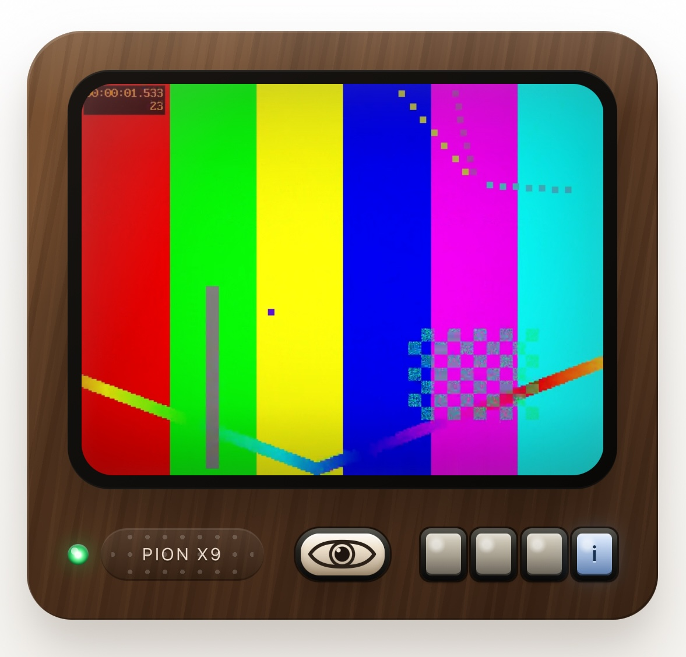

# WebRTC TV



Run the server. Connect from a browser and start camera. Connect from another device and watch the camera feed.

Half of this project's purpose is a fully-private security system. It has user-space Tailscale support, so it
can run on your private VPN, with no public clouds and no public internet. Of course, there are way more mature
and functional solutions, but this one wins on simplicity. You can run it on a spare MacMini, and it requires
only a browser on the camera device - no complicated setup, no separate apps.

Half of the purpose is WebRTC learning.

## Key decisions

We don't use any ICE/STUN. The happy path for the app is Tailscale handling network connectivity.

We want the viewer to smoothly switch between cameras and the static demo track. To achieve that, we ask
for VP8 stream from the camera, and we rewrite the camera RTP streams into an RTP stream per each viewer.
In practice, works fine, including older iOS/iPadOS. We probably can try VP9 later.

For viewer, we show a status indicator based on decoded frames. It turns red if we had no new frames
in the last second. For camera, we use a data channel so that server reports which timestamps it recieved,
and we show red status if the server did not confirm new frames. That way, we see that something is wrong
right away, without waiting for full blown disconencts. There's RTCP protocol that we probably could have used,
but a custom data channel is much more straightfoward.

## Vibecoding disclosure

Vibecoded using GitHub Copilot with GPT 5.4 High.

The overall architecture and the look was heavily steered and manually tested.

The server code was lightly reviewed.

The UI code is wild AI west.

## Run

```bash
go run .
```

Open <http://localhost:8080>.

### Tailscale / tsnet mode

Serve the app over a userspace Tailscale node with HTTPS only:

```bash
go run . -tsnet
```

By default this registers the node as `tv` and stores persistent tsnet state in your user config directory under `tv/tsnet`. You can override those settings:

```bash
go run . -tsnet -tsnet-hostname living-room-tv -tsnet-state-dir /path/to/tsnet-state
```

If the node is not already authenticated, tsnet will print a login URL. You can also provide an auth key with `-tsnet-authkey` or `TS_AUTHKEY`.

When `-tsnet` is enabled, the app listens on Tailscale only and serves HTTPS on port 443 via tsnet-managed certificates.

Click the ivory eye button below the TV to toggle camera mode on that browser. When camera mode is active, that client publishes its webcam to the server and other connected viewers receive the live feed instead of the fallback demo clip. The small lamp between the Pion X9 tag and the speaker grille blinks green each second if at least one fresh frame reached the screen during that interval, otherwise red.
